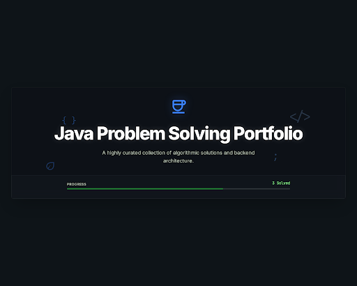

<!-- ═══════════════════════════════════════════════════════════════════════════════
     ██╗     ███████╗███████╗████████╗ ██████╗ ██████╗ ██████╗ ███████╗
     ██║     ██╔════╝██╔════╝╚══██╔══╝██╔════╝██╔═══██╗██╔══██╗██╔════╝
     ██║     █████╗  █████╗     ██║   ██║     ██║   ██║██║  ██║█████╗
     ██║     ██╔══╝  ██╔══╝     ██║   ██║     ██║   ██║██║  ██║██╔══╝
     ███████╗███████╗███████╗   ██║   ╚██████╗╚██████╔╝██████╔╝███████╗
     ╚══════╝╚══════╝╚══════╝   ╚═╝    ╚═════╝ ╚═════╝ ╚═════╝ ╚══════╝
     ═══════════════════════════════════════════════════════════════════════════════ -->

<!-- ╔═══════════════════════════════════════════════════════════════╗ -->
<!-- ║                    HERO BANNER                               ║ -->
<!-- ╚═══════════════════════════════════════════════════════════════╝ -->

<div align="center">

<!-- Animated Top Wave — Stitch Design System Colors -->


<br/>

<!-- Stitch-Designed Hero Banner -->


<br/><br/>

<!-- Typing Animation -->
<a href="https://github.com/Ayushgupta0511/Leetcode_solutions">
  
</a>

<br/><br/>

<!-- Quick Stats Badges -->
<a href="https://github.com/Ayushgupta0511/Leetcode_solutions">
  
</a>
&nbsp;
<a href="https://github.com/Ayushgupta0511/Leetcode_solutions/tree/main/LeetCode/Java/Easy">
  
</a>
&nbsp;

&nbsp;

&nbsp;
<a href="https://github.com/Ayushgupta0511/Leetcode_solutions">
  
</a>

<br/><br/>

<!-- Repo Meta Badges -->

&nbsp;

&nbsp;

&nbsp;


</div>

<!-- Animated Divider -->


<!-- ╔═══════════════════════════════════════════════════════════════╗ -->
<!-- ║                    ABOUT THIS REPO                           ║ -->
<!-- ╚═══════════════════════════════════════════════════════════════╝ -->

## ☕ About This Repository

> **A meticulously organized collection of LeetCode solutions in Java**, built for interview preparation and algorithmic mastery. Every solution is pattern-categorized, clean-coded, and automatically synced via **LeetSync**.

<table>
<tr>
<td width="50%" valign="top">

### 🎯 What's Inside

- 🧩 **Pattern-based organization** — Problems grouped by algorithmic pattern
- 📁 **Dual structure** — Browse by difficulty OR by pattern
- 📊 **GRIND 75 & GRIND 100** — Interview prep trackers included
- 🔄 **Auto-synced** — LeetSync keeps it up to date
- ☕ **Pure Java** — Clean, readable solutions

</td>
<td width="50%" valign="top">

### ⚡ Quick Navigation

| Path | Description |
|:-----|:------------|
| [`Java/Easy/`](./LeetCode/Java/Easy/) | Solutions by difficulty |
| [`Patterns/`](./LeetCode/Patterns/) | Solutions by algorithm pattern |
| [`GRIND_75.md`](./LeetCode/GRIND_75.md) | Grind 75 progress tracker |
| [`GRIND_100.md`](./LeetCode/GRIND_100.md) | Grind 100 progress tracker |

</td>
</tr>
</table>

<!-- Animated Divider -->


<!-- ╔═══════════════════════════════════════════════════════════════╗ -->
<!-- ║                SOLVED PROBLEMS TABLE                         ║ -->
<!-- ╚═══════════════════════════════════════════════════════════════╝ -->

## 🗂️ Solved Problems

<div align="center">

| # | Problem | Difficulty | Pattern | Solution |
|:-:|:--------|:----------:|:--------|:--------:|
| 1 | [Two Sum](https://leetcode.com/problems/two-sum/) |  | `Hash Map` `Array` | [☕ Java](./LeetCode/Java/Easy/1.%20Two%20Sum/Solution.java) |
| 121 | [Best Time to Buy and Sell Stock](https://leetcode.com/problems/best-time-to-buy-and-sell-stock/) |  | `Dynamic Programming` `Array` | [☕ Java](./LeetCode/Java/Easy/121.%20Best%20Time%20to%20Buy%20and%20Sell%20Stock/Solution.java) |
| 283 | [Move Zeroes](https://leetcode.com/problems/move-zeroes/) |  | `Two Pointers` `Array` | [☕ Java](./LeetCode/Java/Easy/283.%20Move%20Zeroes/Solution.java) |

</div>

<!-- Animated Divider -->


<!-- ╔═══════════════════════════════════════════════════════════════╗ -->
<!-- ║                PATTERNS BREAKDOWN                            ║ -->
<!-- ╚═══════════════════════════════════════════════════════════════╝ -->

## 🧠 Patterns Covered

<div align="center">

<table>
<tr>
<td align="center" width="33%">

### 🗺️ Hash Map & Hashing

<br/>


<sub>

| Problem | Link |
|:--------|:----:|
| 1. Two Sum | [📂](./LeetCode/Patterns/Hash%20Map%20%26%20Hashing/1.%20Two%20Sum/) |

</sub>

</td>
<td align="center" width="33%">

### 📈 Dynamic Programming

<br/>


<sub>

| Problem | Link |
|:--------|:----:|
| 121. Buy & Sell Stock | [📂](./LeetCode/Patterns/Dynamic%20Programming/121.%20Best%20Time%20to%20Buy%20and%20Sell%20Stock/) |

</sub>

</td>
<td align="center" width="33%">

### 👆 Two Pointers

<br/>


<sub>

| Problem | Link |
|:--------|:----:|
| 283. Move Zeroes | [📂](./LeetCode/Patterns/Two%20Pointers/283.%20Move%20Zeroes/) |

</sub>

</td>
</tr>
</table>

</div>

<!-- Animated Divider -->


<!-- ╔═══════════════════════════════════════════════════════════════╗ -->
<!-- ║               GRIND PROGRESS TRACKERS                        ║ -->
<!-- ╚═══════════════════════════════════════════════════════════════╝ -->

## 🎯 Interview Prep Progress

<div align="center">

<table>
<tr>
<td align="center" width="50%">

### 🔥 GRIND 75

```
██░░░░░░░░░░░░░░░░░░  2/75  (2.7%)
```

**Completed:** Two Sum · Best Time to Buy and Sell Stock

<a href="./LeetCode/GRIND_75.md">
  
</a>

</td>
<td align="center" width="50%">

### 💎 GRIND 100

```
██░░░░░░░░░░░░░░░░░░  3/100  (3.0%)
```

**Completed:** Two Sum · Move Zeroes · Best Time to Buy and Sell Stock

<a href="./LeetCode/GRIND_100.md">
  
</a>

</td>
</tr>
</table>

</div>

<!-- Animated Divider -->


<!-- ╔═══════════════════════════════════════════════════════════════╗ -->
<!-- ║               DIFFICULTY DISTRIBUTION                        ║ -->
<!-- ╚═══════════════════════════════════════════════════════════════╝ -->

## 📊 Difficulty Distribution

<div align="center">

```
Easy     ███████████████████████████████████  3  (100%)
Medium   ░░░░░░░░░░░░░░░░░░░░░░░░░░░░░░░░░  0  (  0%)
Hard     ░░░░░░░░░░░░░░░░░░░░░░░░░░░░░░░░░  0  (  0%)
─────────────────────────────────────────────────
Total                                         3
```

</div>

<!-- Animated Divider -->


<!-- ╔═══════════════════════════════════════════════════════════════╗ -->
<!-- ║               REPOSITORY STRUCTURE                           ║ -->
<!-- ╚═══════════════════════════════════════════════════════════════╝ -->

## 🏗️ Repository Structure

```
📦 Leetcode_solutions
├── 📄 README.md                          ← You are here
├── 🎨 assets/
│   ├── banner.png                        ← Stitch-designed hero banner
│   └── banner.html                       ← Interactive Three.js version
└── 📂 LeetCode/
    ├── 📊 GRIND_75.md                    ← Interview prep tracker
    ├── 📊 GRIND_100.md                   ← Extended interview prep
    ├── ☕ Java/
    │   ├── 📄 README.md                  ← Auto-generated stats
    │   └── 🟢 Easy/
    │       ├── 1. Two Sum/
    │       │   ├── README.md
    │       │   └── Solution.java
    │       ├── 121. Best Time to Buy and Sell Stock/
    │       │   ├── README.md
    │       │   └── Solution.java
    │       └── 283. Move Zeroes/
    │           ├── README.md
    │           └── Solution.java
    └── 🧩 Patterns/
        ├── Dynamic Programming/
        │   └── 121. Best Time to Buy and Sell Stock/
        ├── Hash Map & Hashing/
        │   └── 1. Two Sum/
        └── Two Pointers/
            └── 283. Move Zeroes/
```

<!-- Animated Divider -->


<!-- ╔═══════════════════════════════════════════════════════════════╗ -->
<!-- ║                    TECH STACK                                ║ -->
<!-- ╚═══════════════════════════════════════════════════════════════╝ -->

## ⚙️ Tech Stack

<div align="center">

<a href="https://skillicons.dev">
  
</a>

<br/><br/>

<table>
<tr>
<td align="center">
  
  <br/><sub><b>Primary Language</b></sub>
</td>
<td align="center">
  
  <br/><sub><b>Auto Sync</b></sub>
</td>
<td align="center">
  
  <br/><sub><b>Banner Design</b></sub>
</td>
<td align="center">
  
  <br/><sub><b>Banner Animation</b></sub>
</td>
</tr>
</table>

</div>

<!-- Animated Divider -->


<!-- ╔═══════════════════════════════════════════════════════════════╗ -->
<!-- ║                   QUICK LINKS                                ║ -->
<!-- ╚═══════════════════════════════════════════════════════════════╝ -->

## 🔗 Quick Links

<div align="center">

<a href="https://leetcode.com/Ayushgupta0511/" target="_blank">
  
</a>
&nbsp;
<a href="https://github.com/Ayushgupta0511" target="_blank">
  
</a>
&nbsp;
<a href="https://www.linkedin.com/in/ayush-gupta0511/" target="_blank">
  
</a>
&nbsp;
<a href="./assets/banner.html" target="_blank">
  
</a>

</div>

<!-- Animated Divider -->


<!-- ╔═══════════════════════════════════════════════════════════════╗ -->
<!-- ║                        FOOTER                                ║ -->
<!-- ╚═══════════════════════════════════════════════════════════════╝ -->

<div align="center">

<br/>


<br/><br/>

<!-- Made with Love -->


<br/><br/>

<!-- Animated Bottom Wave — Stitch Design System Colors -->


</div>

<!-- ═══════════════════════════════════════════════════════════════════════════════
     Built with ☕ by Ayush Gupta
     Banner designed in Google Stitch · Animated with Three.js
     Auto-synced via LeetSync
     ═══════════════════════════════════════════════════════════════════════════════ -->
